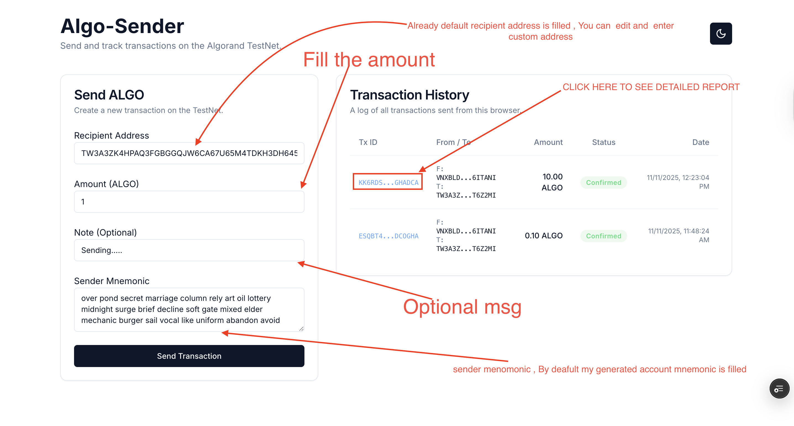

# Algorand TestNet Transaction Sender

Full-stack reference app for sending, persisting, and tracking Algorand TestNet transactions. The project combines a Vite + React client and an Express + MongoDB backend that handles Algorand network interactions with `algosdk`.

## What’s Inside
- **Frontend (`client/`)** – React 19 UI with Tailwind CSS, dark/light themes, toast notifications, and a polling transaction list. The form validates mnemonics and addresses in-browser via the Algorand SDK loaded from CDN.
- **Backend (`server/`)** – TypeScript Express API under `/api/algorand` for sending transactions, listing history, and refreshing on-chain status. Uses MongoDB for persistence and rechecks confirmations with `algosdk.Algodv2`.
- **Shared Model** – Transactions are stored in microAlgos and exposed to the client using the shared `Transaction` shape so UI components can format amounts in ALGO.

## Quick Start
1. **Install dependencies**
	```bash
	cd client && npm install
	cd ../server && npm install
	```
2. **Configure environment** – Copy `server/.env.example` to `server/.env` and provide `MONGODB_URI`, `ALGOD_SERVER`, and related Algorand node details. For the frontend, set `VITE_BACKEND_URL` (e.g. `http://localhost:5001/api/algorand`).
3. **Run the backend**
	```bash
	cd server
	npm run dev
	```
4. **Run the frontend**
	```bash
	cd ../client
	npm run dev
	```
	The UI launches on `http://localhost:3000` (configured via `vite.config.ts`).

## Key Features
- Submit Algorand TestNet transactions securely through the backend; mnemonics are not persisted.
- Auto-refresh transaction history with confirmed/pending status, explorer links, and toast notifications.
- Generate fresh test accounts via `server/src/generate.js` when you need disposable TestNet wallets.

## Additional Docs
- Frontend specifics: `client/README.md`
- Backend specifics: `server/README.md`